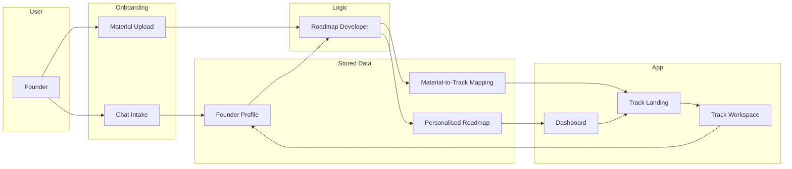

# FounderOS — Architecture & Data

> How the system fits together and what lives where.

---

## Core Principle

**Chat** is the *thinking space*. **Documentation** is the *output space*. The **roadmap** is the *navigation layer*. All three are persistent, locally stored, and independently editable.

---

## Data Flow

High level: **User** completes onboarding (chat + uploads) → **Founder profile** and uploads go to **Roadmap Developer** → outputs **personalised roadmap** and **material-to-track mapping** → **Dashboard** shows roadmap; **Track Landing** shows sorted materials; **Track Workspace** uses module chats, saved MDs, and progress.

---

## Key Artifacts

| Artifact | Location / convention | Purpose |
| -------- | --------------------- | ------- |
| **Roadmap Developer** | One MD file or script (e.g. `Roadmap_Developer.md` or equivalent) | Inputs: founder profile, goal, progress, list of uploaded assets. Outputs: (1) personalised roadmap (track IDs + start/end), (2) mapping of each asset → track ID (optional: module ID). |
| **Expert MD files** | One per module; path convention e.g. `expert_mds/{track_id}/{module_id}.md` | Structured, opinionated guidance for that module; AI pulls this file in the module chat. |
| **Founder profile** | Stored object (e.g. in local storage or as JSON/MD) | Structured: identity, problem, solution, goal, progress, strengths, gaps. |
| **Saved chat summaries** | MD files per module/session; e.g. `workspace/{track_id}/{module_id}_summary.md` | Loaded at start of next session so the AI "remembers" progress. |
| **Priority agent** | In-app (e.g. dashboard or track view) | Reads current progress; suggests (1) tasks highest priority due to dependencies, (2) quick tasks (&lt;15 min) for momentum. Does not lock the founder into a sequence — see [ROADMAP_AND_TRACKS.md](ROADMAP_AND_TRACKS.md). |

---

## Local Storage Strategy (MVP)

No backend required for MVP. Store locally (e.g. browser `localStorage`, IndexedDB, or local files if building desktop/Electron):

- **Founder profile** — structured object from onboarding
- **Personalised roadmap** — which tracks, start index, end index (or equivalent)
- **Material-to-track mapping** — which uploaded assets belong to which track(s); one asset can map to multiple tracks (show it in each relevant track’s landing)
- **Kanban board** — tasks (title, status, optional track/module)
- **Sticky notes** — freeform text
- **Upload refs** — references to uploaded files (e.g. base64, blob URLs, or file paths depending on env)
- **Chat summary MDs** — content of saved summaries per track/module
- **Progress state** — which deliverables are marked done per module (for progress bars)

---

## Stack Suggestion (Hackathon)

- **Frontend:** Single-page app (e.g. React, Vue, or vanilla) with local-first state.
- **Persistence:** `localStorage` or IndexedDB for profile, roadmap, kanban, stickies; optional file-based storage for uploads and MDs if target is desktop.
- **AI:** Use existing API (e.g. OpenAI, Anthropic) for onboarding chat and module chats; pass founder profile and expert MD content as context. No auth required for MVP demo.
